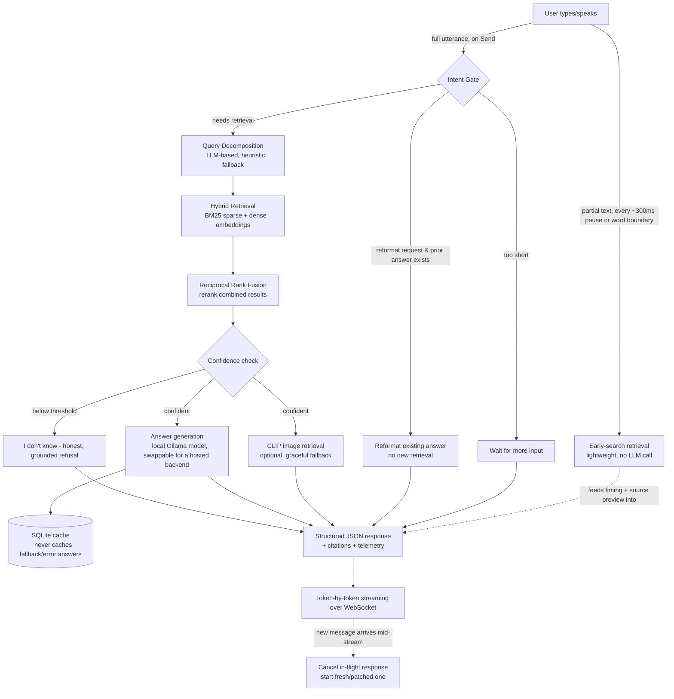

# Streaming-Live-RAG
# Streaming Live RAG Engine

**PRISM Generative AI Hackathon 2026-27 — Theme 04: Streaming Live RAG**
DEMO VIDEO: https://drive.google.com/file/d/1wyqi086VAOR4NhGvqhzLF84P_I9Uh828/view?usp=sharing

A retrieval-augmented conversational backend that handles a single natural
spoken request (not a tidy search query), decomposes it into the questions
it actually implies, retrieves and fuses evidence from multiple sources, and
improves its answer as the user adds detail mid-conversation — instead of
restarting from scratch.

## Problem statement (in our own words)

In a real, full-duplex conversation, a user doesn't phrase things as clean
search queries. One sentence can hide several distinct questions, the system
has no idea how retrieval works internally, and if the user adds a correction
or detail partway through, a naive assistant either ignores it or throws away
everything and starts over. We built a pipeline that: decides whether a
request even needs retrieval, splits compound requests into their real
sub-questions, retrieves using both keyword and semantic search, is honest
when it can't find a confident answer instead of guessing, and can be
interrupted and corrected mid-response without losing useful context.

## Architecture



**Key design decisions:**

- **Local-first by default.** The LLM backend is an abstraction
  (`app/llm_backend.py`) with a local path (Ollama) and a hosted path (not
  wired to a real provider on purpose — it exists to prove the architecture
  is swappable, not to be used for judging). This is a deliberate reliability
  and privacy trade-off, not an oversight — see Limitations below for what it
  costs us in speed.
- **Hybrid retrieval, not just embeddings.** BM25 (keyword) and dense vector
  search (`app/retriever.py`) are combined via Reciprocal Rank Fusion, which
  measurably improves retrieval quality over either alone.
- **Decomposition only when needed.** A cheap heuristic check decides
  whether a query even looks compound before paying for an LLM call to
  decompose it — this roughly halves latency for the common case of a
  single, simple question.
- **Honesty over guessing.** If retrieved evidence doesn't clear a
  similarity threshold, the system says so explicitly instead of generating
  a plausible-sounding but ungrounded answer.
- **A persistent, guarded cache**, not just an in-memory one, so a question
  answered once stays fast across server restarts — and fallback/error
  answers are never cached, so a temporary model outage can't permanently
  "poison" a question with a stale placeholder.

## Features implemented

| Area | What it does |
|---|---|
| Intent gating | Skip / wait / retrieve / reformat-only, based on the query |
| Query decomposition | LLM-based, with a deterministic heuristic fallback; skipped entirely for simple non-compound queries |
| Hybrid retrieval | BM25 (keyword) + dense embeddings, fused via Reciprocal Rank Fusion |
| Honest uncertainty | Refuses to guess when retrieval confidence is below threshold |
| Structured output | JSON with answer, citations, sub-queries, confidence, timing — not just prose |
| Swappable backend | Local (Ollama, default) or hosted (stubbed, proves the architecture is swappable — not used for judging) |
| Persistent cache | SQLite-backed, survives restarts, never caches fallback/error answers |
| Early/streaming search | Retrieval runs on partial typed text as the user types, visualized live in an "Early Search Timeline" panel, with explicit "retrieval started before query ended" and "time to first token" metrics |
| Mid-answer interruption | A new message cancels the in-flight response's token stream immediately (one documented limitation below) |
| Multimodal retrieval | CLIP-based text-to-image search (`app/image_retriever.py`); gracefully disables itself if the model can't load |
| Adversarial benchmark | `app/benchmark.py` — 9 independent, order-safe test cases (see Results) |

**Deliberately not implemented:** true audio-based partial-utterance
streaming — we approximate "early search" using partial *typed* text rather
than partial *spoken* audio, which the brief explicitly allows by permitting
simulated/transcript-based voice input.

## Project structure

```
.
├── app/
│   ├── __init__.py
│   ├── config.py           # Settings, env-var driven (model name, thresholds, etc.)
│   ├── llm_backend.py       # Swappable local (Ollama) / hosted LLM interface
│   ├── retriever.py         # Hybrid BM25 + dense retrieval with RRF
│   ├── image_retriever.py   # CLIP-based text-to-image retrieval, graceful fallback
│   ├── cache.py             # Guarded SQLite query cache
│   ├── pipeline.py          # Core orchestration: intent gate, decomposition, confidence gate
│   └── benchmark.py         # Adversarial test suite (9 cases)
├── static/
│   ├── index.html           # Observability dashboard frontend (see note below)
│   └── images/              # Sample placeholder corpus diagrams for multimodal retrieval
├── main.py                  # FastAPI app + WebSocket router
├── requirements.txt
├── Dockerfile
├── docker-compose.yml       # App + Ollama as two services
├── .gitignore
└── README.md
```

## Setup

### Option A — local (Python + Ollama)

Tested and developed against **Python 3.8.2** (the exact dependency
versions in `requirements.txt` were chosen for this compatibility); Python
3.9+ should also work.

```bash
python -m venv venv
source venv/bin/activate        # Windows: venv\Scripts\activate
pip install -r requirements.txt

# Install Ollama separately: https://ollama.com/download
ollama pull qwen2.5:0.5b-instruct

export LOCAL_LLM_MODEL=qwen2.5:0.5b-instruct   # Windows: set LOCAL_LLM_MODEL=qwen2.5:0.5b-instruct
python main.py
# (equivalently: uvicorn main:app --reload, which also gives you auto-reload)
```

Open http://localhost:8000.

### Option B — Docker

```bash
docker compose up -d
docker compose exec ollama ollama pull qwen2.5:0.5b-instruct
```

Open http://localhost:8000.

### Running the benchmark

```bash
python -m app.benchmark
```

Prints pass/fail/skip and latency for each of the 9 adversarial test cases,
covering the core pipeline, decomposition skip-logic, cache correctness
(including the fallback-answer guard), and multimodal retrieval.

## Configuration

All tunable via environment variables (see `app/config.py`):

| Variable | Default | Purpose |
|---|---|---|
| `LOCAL_LLM_MODEL` | `llama3.2:1b` | Which Ollama model to use |
| `LOCAL_LLM_URL` | `http://localhost:11434/api/generate` | Ollama endpoint |
| `USE_HOSTED_BACKEND` | `false` | Switch to the (unimplemented-by-design) hosted path |
| `SIMILARITY_THRESHOLD` | `0.35` | Below this, the system says "I don't know" |
| `MIN_WORDS_BEFORE_RETRIEVAL` | `3` | Below this word count, the system waits instead of answering |

## Known limitations

- **Latency is hardware-dependent and, on constrained CPUs, genuinely
  slow.** Development and testing were done on a 2015-era dual-core laptop
  CPU, where a cold (non-cached) answer takes on the order of 10-30+
  seconds. This is a measured property of CPU-only local LLM inference
  (memory-bandwidth bound, not just core-count bound), not a bug — we'd
  expect roughly a 3-5x speedup on typical modern hardware based on standard
  memory-bandwidth scaling for CPU-only inference. The cache makes any
  *repeated* query near-instant regardless of hardware.
- **Mid-answer interruption cannot forcibly kill a blocking model call
  already in flight** — only the token-streaming phase is truly
  interruptible. In practice this means interruption is fully responsive
  once a response starts appearing, with a small fixed window at the very
  start of a call where cancellation is requested but takes effect once that
  call returns. This is covered by manual/integration testing, not the
  automated benchmark (which is synchronous and can't drive the WebSocket
  interruption flow).
- **The dashboard shown in the demo is a developer/observability
  interface**, built to expose internal pipeline state (retrieval timing,
  decomposition, cache hits) for development and evaluation. A production
  deployment would show end users only the conversational interface, with
  this telemetry available to developers separately (logs/dashboards), not
  inline in the chat UI.
- **Early search approximates "begin retrieving before the utterance ends"
  using partial typed text**, not partial spoken audio — a legitimate
  stand-in given the brief explicitly allows simulating voice input from
  transcripts, but worth stating plainly rather than implying real-time
  audio streaming.
- **Multimodal retrieval is implemented but not independently verified
  end-to-end on submission hardware.** `app/image_retriever.py` uses CLIP
  for text-to-image search against 3 synthetic placeholder diagrams
  (`static/images/`) generated for this submission, not real corpus images.
  The CLIP model download did not reliably complete on our development
  hardware/network in the time available, so while the retrieval mechanism
  and its graceful fallback are complete and reviewed, we can't claim a
  verified live result — it gracefully disables itself (falls back to
  text-only) rather than breaking the app when the model is unavailable.

## Results


